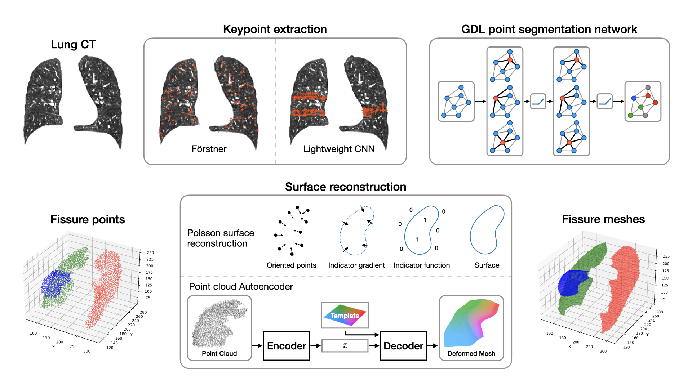

# Sparse Keypoint Segmentation of Lung Fissures: Efficient Geometric Deep Learning for Abstracting Volumetric Images
This repository contains the code for segmenting pulmonary fissures in CT images using keypoint extraction and geometric deep learning.



# Usage
## Install environment
Install the required packages using Anaconda and the provided environment file:
```bash
conda env create -f environment.yml
conda activate fissure-segmentation
```

# Data
Datasets used in the evaluation are openly available for research purposes. Please refer to the original sources 
detailed below.

## Training / cross-validation data
The TotalSegmentator data set is the main data set used for this work. 
Download it from here: https://doi.org/10.5281/zenodo.6802614 (v1.0).
The data has to be preprocessed with `preprocess_totalsegmentator_dataset.py`, make sure to point to the correct data
path `TS_RAW_DATA_PATH` in `constants.py`. The script selects applicable images (showing the entire thorax), extracts fissure 
segmentations from the lobe masks and crops the images to the thoracic region. Results will be written to 
`IMG_DIR_TS_PREPROC`.

## COPD validation data set
The COPD data set can be accessed here: https://med.emory.edu/departments/radiation-oncology/research-laboratories/deformable-image-registration/downloads-and-reference-data/copdgene.html
(citation: Castillo et al., Phys Med Biol 2013 https://doi.org/10.1088/0031-9155/58/9/2861)
The manual fissure annotations are available from here: http://www.mpheinrich.de/research.html#COPD (citation: 
Rühaak et al., IEEE TMI 2017 https://doi.org/10.1109/TMI.2017.2691259).

The images should be named `<patid>_img_<fixed/moving>.nii.gz` and be in the same folder (`data/images/COPD`) as the
fissure annotations `<patid>_fissures_<fixed/moving>.nii.gz` and lung masks `<patid>_mask_<fixed/moving>.nii.gz`.
Masks can be generated automatically by, e.g., using the `lungmask` tool https://github.com/JoHof/lungmask.

Then, preprocessing can be applied by running `preprocess_copd_dataset.py`.

## Pre-computing keypoints and features
Keypoints and features are pre-computed from the image data. Run the following scripts:
1. `python -m data_processing.keypint_extraction`
2. `python -m data_processing.point_features`
Results will be written into `data/points` by default.

## Train models
The different models can be trained using the following scripts:
- Point Cloud segmentation networks (DGCNN, PointNet, PointTransformer): `train_point_segmentation.py`
- Point Cloud Autoencoder (PC-AE): `train_pc_ae.py`
- Keypoint CNN (MobileNetV3 + LR-ASPP): `train_keypoint_cnn.py` (pre-trained weights are available in `results/lraspp_recall_loss`)
Run the scripts with the `-h` flag to see available options.

## Evaluate models
The given training scripts already contain test functions for all models.

Evaluation of the PC-AE reconstruction of fissures can be done using the `evaluate_pc_ae.py` script. This will take a
trained point cloud segmentation network and apply a trained PC-AE for mesh reconstruction (instead of Poisson surface
reconstruction). 

The nnU-Net baseline was evaluated using `evaluate_nnunet.py`.

# Citation
Please cite the following papers if you use parts of this code in your own work:

- Journal paper for Point Cloud Autoencoder (PC-AE) and comparison of geometric segmentation networks (under review):
```
@article{Kaftan2024_FissureSegmentation_IJCARS,
  title={Sparse Keypoint Segmentation of Lung Fissures: Efficient Geometric Deep Learning for Abstracting Volumetric Images},
  author={Kaftan, Paul and Heinrich, Mattias P and Hansen, Lasse and Rasche, Volker and Kestler, Hans A and Bigalke, Alexander},
  journal={International Journal of Computer Assisted Radiology and Surgery},
  year={tbd},
  volume={tbd},
  number={tbd},
  pages={tbd},
  doi={tbd}
}
```

- Conference paper for comparison of more keypoints and features:
```
@InProceedings{Kaftan2024_FissureSegmentation_BVM,
  author = {Kaftan, Paul and Heinrich, Mattias P. and Hansen, Lasse and Rasche, Volker and Kestler, Hans A. and Bigalke, Alexander},
  editor = {Maier, Andreas and Deserno, Thomas M. and Handels, Heinz and Maier-Hein, Klaus and Palm, Christoph and Tolxdorff, Thomas},
  title = {Abstracting Volumetric Medical Images with Sparse Keypoints for Efficient Geometric Segmentation of Lung Fissures with a Graph CNN},
  booktitle = {Bildverarbeitung f{\"u}r die Medizin 2024},
  year = {2024},
  publisher = {Springer Fachmedien Wiesbaden},
  address = {Wiesbaden},
  pages = {60--65},
  isbn = {978-3-658-44037-4},
  doi = {10.1007/978-3-658-44037-4_19}
}
```
